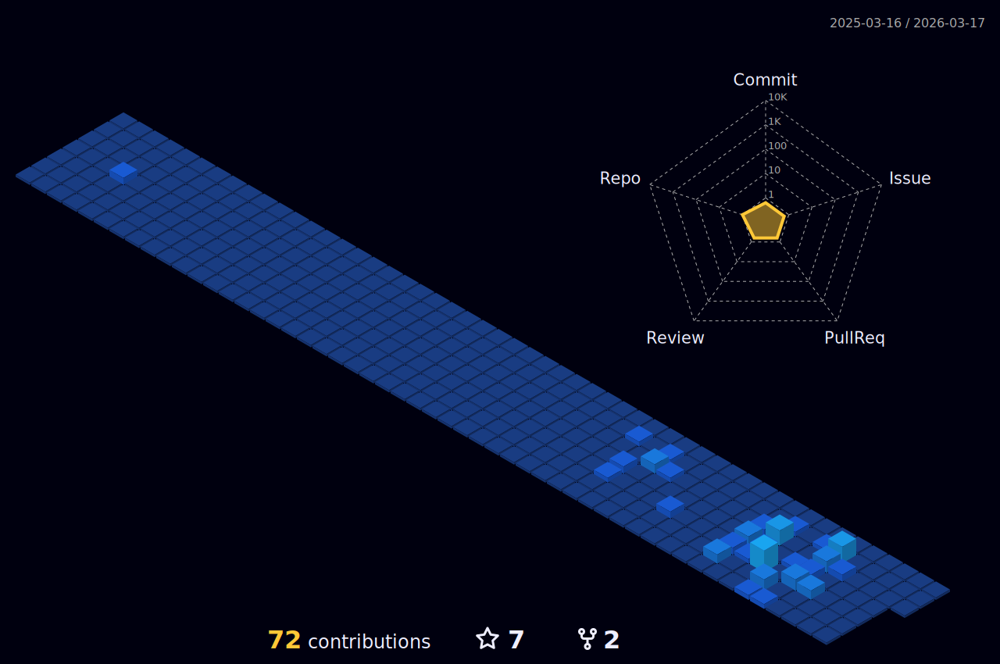

# 👋 Welcome to My GitHub Profile!

## 💡 About Me:  
**Technologist with a Passion for Innovation**  
I love exploring cutting-edge technologies, developing innovative solutions, and tackling new challenges with the goal of expanding technological horizons.  

## 📚 Core Skills  

**Languages:** 🐍 Python | 🛠️ C# | 🌐 HTML5, CSS3 | ✨ JavaScript  

**Frameworks & Technologies:**  🌟 Django | 🏗️ ASP.NET | 🔗 REST API | 🐳 Docker | 🔒 Keycloak | 📦 Odoo | 🎨 Bootstrap, JQuery 

**Databases:** 🐬 MySQL/MariaDB | 🐘 PostgreSQL |🔥 Firebase | 📁 SQLite  

**Tools & Platforms:** 🌲 Git | ✏️ Visual Studio Code, Visual Studio  | 🎮 Unity  | 🤖 Android Studio  

---

## 🚀 Future Goals & Vision  
I’m excited about working on projects that combine technological innovation with real-world impact, improving processes and solutions through code.  
I strongly believe in the power of teamwork and collaboration to overcome daily challenges and achieve extraordinary results.  
